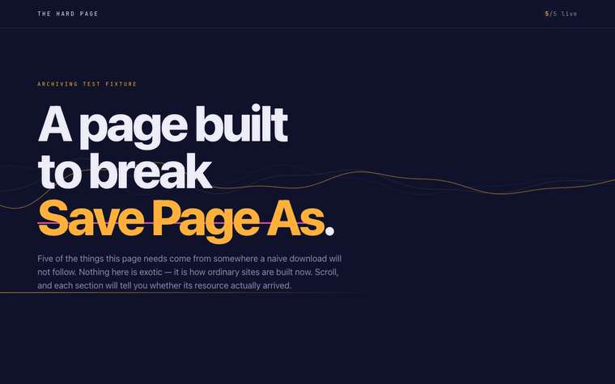
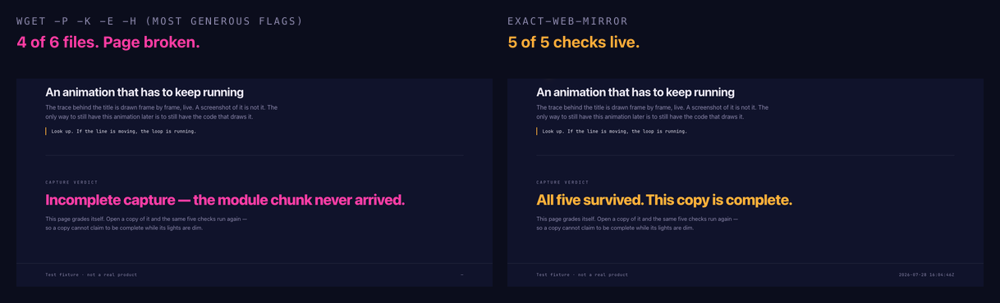

# 🪞 exact-web-mirror

### Ever seen an animation on a site and wondered *how did they build that?* 🤔

Open the page, hit **Save Page As**, and you get… a broken mess. No styles. No motion. Half the
files missing. The one thing you actually wanted — the code that makes it move — is gone. 😤

**exact-web-mirror captures the page for real.** Every byte the browser received, saved exactly as
it arrived, so the site's own HTML, CSS, JavaScript, fonts, and video keep running from a folder on
your disk. Every animation is the original code executing — not a screenshot, not a rebuild. ✨



> ☝️ That's a **local copy**, running with the network cut off. The counter in the corner is the page
> checking itself: 5 / 5 of its resources survived. Read on for what those five are. 👇

---

## 🎯 What's it actually for?

- 🎬 **Learning how a site is built.** Scroll effects, WebGL heroes, canvas loops, clever CSS — you
  get the real source on disk to open in an editor and step through in DevTools.
- 🗄️ **Keeping a page before it changes.** Redesigns happen. Products get discontinued. A capture is
  a page exactly as it was on the day you took it.
- ✈️ **Reading things offline.** Genuinely offline — a plane, a train, a bad hotel wifi.
- 🧪 **Testing against a real page** without hammering someone's production server every run.

## 😬 Why "Save Page As" and wget aren't enough

They grab the HTML and whatever is *written in it*. But modern sites don't put it all in the HTML —
they assemble themselves while running, fetching scripts, fonts, data, and video from other domains
with addresses computed on the fly. There's nothing in the file to follow.

Here's a real run against [the demo page in this repo](demo/), giving wget the most generous flags
it has (`-p -k -E -H -e robots=off`):



wget does **well** — it gets the HTML, the stylesheet, the entry module, even the video. It still
can't get the two files that only exist once the page is running, and the page notices. 🕵️

## 🧠 So how does this work?

Instead of guessing what a page needs, it **watches a real browser load it** and records every
network response byte for byte. Then it serves those exact bytes back from your disk. 🎥

The bytes are never rewritten — rewriting URLs inside files corrupts length-prefixed streams like
React Server Components, and misses addresses the site builds at run time anyway. A tiny service
worker maps the page's original URLs onto the local files at request time instead, so the site's own
JavaScript runs completely unmodified. It just can't tell that its "internet" is now a folder. 🤫

Then it **proves it worked**: it reloads your copy with every non-localhost request blocked,
screenshots it, and diffs it against screenshots of the live page band by band. You get a
PASS/REVIEW verdict and side-by-side strips you can check yourself. 📊

---

## ⚡ Install

You'll need **macOS or Linux**, **Node.js 18+**, **Google Chrome**, and **`unzip`**. First run pulls
in ~400 MB of Playwright and sharp.

### 🔌 As a Claude Code plugin (easiest)

```
/plugin marketplace add tonyyunyang/exact-web-mirror
/plugin install exact-web-mirror@exact-web-mirror
```

Restart Claude Code or `/reload-plugins`, then ask Claude to **run the exact-web-mirror setup** — it
knows where the plugin landed. From a terminal instead:

```bash
node "$(find ~/.claude/plugins/cache -path '*exact-web-mirror/scripts/setup.mjs' | head -1)"
```

> ℹ️ Installing a plugin *update* replaces its folder and discards the installed dependencies. Re-run
> setup if a capture suddenly reports a missing `playwright`.

### 🛠️ As a personal skill

```bash
git clone https://github.com/tonyyunyang/exact-web-mirror.git ~/src/exact-web-mirror
~/src/exact-web-mirror/install.sh
```

Symlinks the skill into `~/.claude/skills/` so `git pull` updates it, then installs dependencies.
Flags: `--copy`, `--project`, `--uninstall`, `--no-setup`.

### 💻 Standalone, no Claude Code at all

```bash
git clone https://github.com/tonyyunyang/exact-web-mirror.git
cd exact-web-mirror/skills/exact-web-mirror/scripts
npm install && npx playwright install chrome
```

> Claude Code installs skills as directories, not archives — there's no `.skill` bundle here. (A
> zipped skill folder is the upload format for claude.ai, a different surface.)

---

## 🚀 Use it

### 💬 With Claude Code

Just ask, in your own words:

- *"Make an offline copy of example.com that still works"* 🪄
- *"Mirror this landing page so I can study how the hero animation is built"* 🔍
- *"Snapshot this page before they redesign it"* 📸

Claude runs the pipeline and reports where the copy landed and how it verified. A real page takes
**5–15 minutes** to capture and verify — that's normal, it's driving a browser through the whole page
twice. ⏳

### ⌨️ From the command line

```bash
S=skills/exact-web-mirror/scripts     # or ~/.claude/skills/exact-web-mirror/scripts

node "$S/setup.mjs"                                    # once per machine
node "$S/archive.mjs" https://example.com/ --verify     # capture + prove it
```

Options: `--out <dir>` (default `./archives`), `--name <slug>`, `--port <N>`, `--headful` (watch the
browser work — handy if a site challenges the capture), `--verify`.

### 📂 What you get

```
archives/example-com/
├── webpage/     the site's real files, byte-pristine, + a double-click opener and __serve.mjs
├── archive/     the raw capture: desktop.har.zip, mobile.har.zip, media/ — this is the master
├── qa/          live-* vs local-* screenshots and bands-*/ side-by-side diff strips
└── logs/        request/console logs and the verification verdict
```

Open a copy any time — double-click `webpage/OPEN.command` (macOS), run `webpage/OPEN.sh` (Linux),
or `node <copy>/webpage/__serve.mjs . 8890 --open` anywhere. The server travels *inside* the folder,
so you can zip a copy and hand it to someone who has Node and nothing else. 📮

<details>
<summary>🤨 Why does it need a local server instead of just opening index.html?</summary>

Browsers refuse to run service workers and ES modules from a bare `file://` page. That's a browser
security rule, not a limitation of the copy. The opener starts a Node server bound to `127.0.0.1`,
opens the page, and stops when you close the window. Nothing is installed and nothing leaves your
machine.
</details>

---

## 🧪 Try it on the demo page

This repo ships **[The Hard Page](demo/)** — a fixture built to be hard to copy, and which grades
its own capture. Everything on it is original to this repo, so you can capture it, break it, and
share the results freely. 🆓

```bash
cd demo && node serve-demo.mjs --open        # then capture it from another terminal
```

## 🔧 Running the stages yourself

`archive.mjs` is `record` → `extract-media` → `export`; `--verify` adds the last stage.

| Stage | Command | What it does |
|---|---|---|
| 🎥 Record | `node record.mjs <url> <dir>` | Drives real Chrome through the page at desktop and mobile sizes, recording every response into HAR zips, and screenshots the live page as ground truth |
| 🎞️ Extract media | `node extract-media.mjs <dir>` | Pulls complete video/audio bodies out of the HARs (streamed video otherwise records as empty range chunks) |
| 📦 Export | `node export.mjs <dir> <url>` | Unpacks the HARs into `webpage/` as pristine files, plus the service worker and map that make original URLs resolve locally |
| 🌐 Serve | `node serve.mjs <dir>/webpage [port] --open` | Static server with the URL mapper and HTTP Range support |
| ✅ Verify | `node verify.mjs <dir>` | Replays the copy with all non-localhost traffic blocked, screenshots it, and band-compares against the live baseline |

Only `record` and `verify` need Chrome. `export` and `serve` run on plain Node, so an existing
capture can be re-exported or viewed on a machine with nothing installed.

The hard-won details — streamed video recording as empty 206s, why you must never rewrite captured
bytes, service-worker redirect semantics breaking module imports, CDN MIME quirks — are in
[`references/internals.md`](skills/exact-web-mirror/references/internals.md). Read it before
debugging a capture that didn't come out identical. 🔬

## 🙅 What it deliberately doesn't do

A copy is a faithful **view**, not a working site. Forms, logins, search, and chat post to dead
endpoints. Analytics beacons get blocked or 404. Links to pages you didn't capture 404 too — capture
those URLs as well if you need them. The dead endpoints are on purpose: the output is a read-only
archive, and it's meant to stay one. 🔒

## 🗂️ Repository layout

```
.claude-plugin/        plugin + marketplace manifests
skills/exact-web-mirror/
  SKILL.md             what Claude reads: when to use this and how
  references/          design notes and debugging gotchas
  scripts/             the pipeline
demo/                  The Hard Page fixture + the recordings above
install.sh             symlink or copy the skill into ~/.claude/skills/
```

---

## ⚠️ Using this responsibly

Archiving web pages is ordinary and long-established — it's what the Internet Archive, pywb,
Webrecorder, and browsertrix do, and what every browser's "Save Page As" attempts and does badly.
The tool is not the sensitive part. What you point it at, and what you do with the result, is where
the care goes. Five minutes of reading, once.

**📚 The copy is someone else's work.** A captured page brings their code, images, video, and fonts
with it — and commercial webfont licenses in particular are usually tied to a specific domain and do
not travel with a copy. Keeping a local copy to read offline, study how something is built, test
against, or preserve is a normal use. Republishing it, serving it to other people, or lifting its
assets into a site you're building is a different thing entirely, and "byte-exact" makes that hard
to argue about.

**🚪 Only capture what you could already open.** The pipeline drives an ordinary browser to an
ordinary URL. It doesn't break anything open and shouldn't be made to. Don't reach for material
behind a paywall or a login you don't have, and don't use it to step around an access control —
that's the line where copying a web page stops being a copyright question and becomes a
computer-misuse one.

**📜 Check the site's terms.** Plenty of sites restrict automated access or copying in their terms
of service. That's between you and them, but it's worth two minutes before you capture.

**🔑 Your archive holds more than the page.** `archive/*.har.zip` is a complete network recording:
every request and response, **headers and cookies included**. Capture anything while signed in and
your session material is in there. The exported `webpage/` folder holds only response bodies and a
content-type map, so that's the one to hand around — think before sharing raw HARs.

**🎭 Don't stand a copy up as the real thing.** A pixel-exact offline copy of a sign-in page becomes
a phishing page the moment someone hosts it publicly and wires the form to a collector. This
pipeline produces dead endpoints on purpose. Leave them dead, don't serve a copy from a domain that
implies it's the original, and don't use it to impersonate a person or an organization.

**🐢 Keep the volume sane.** This is a per-page tool that loads a page a handful of times, the way a
visitor would. It isn't a crawler and shouldn't be turned into one by looping it over a whole site.

None of this is legal advice, and the answers genuinely differ by country and by purpose — personal
study, research, journalism, and commercial use are not treated the same way. If a particular
capture matters, ask someone who can advise you properly.

## 📄 License

[MIT](LICENSE) — do what you like with the tool, including commercially, with attribution and no
warranty.

That covers **this software only**. It grants you nothing over any website you copy with it: the
rights in captured content stay with whoever owned them, which is what the section above is about.
